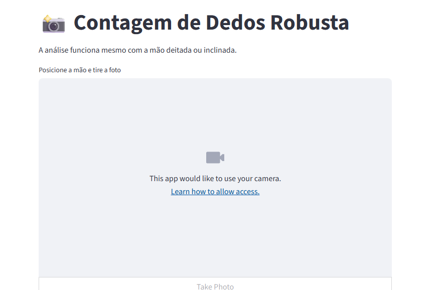

# Cloud-Native Gesture Analytics: MediaPipe & Streamlit on OCI

## 📌 Project Overview
Este projeto implementa um pipeline de visão computacional em nuvem projetado para **análise de gestos em tempo real**. Utilizando a biblioteca **MediaPipe**, o sistema processa capturas de imagem (*snapshots*) para identificar os 21 marcos anatômicos das mãos (*hand landmarks*) e realizar a contagem de dedos de forma precisa.

A solução foca na eficiência de processamento em ambientes de hardware limitado, utilizando a **Oracle Cloud Infrastructure (OCI)** para hospedar a lógica de IA e o **Cloudflare Tunnels** para garantir uma conectividade segura e estável, superando limitações de DNS dinâmico e endereçamento fixo.

  
   
  <em>Streamlit Interface - Detecção de Landmarks e Contagem de Dedos em Tempo Real</em>

---

## 🏗 Architecture
A arquitetura foi otimizada para rodar em uma instância **OCI Always Free** com recursos mínimos (1 Core), demonstrando resiliência técnica e "Owner Mindset":

### 1. Interface & Capture Layer (Edge/Browser)
* **Framework:** Streamlit Web App para interface do usuário.
* **Capture:** Sistema baseado em *snapshot* (processamento em memória RAM, sem persistência em disco para garantir privacidade e economia de storage).
* **Network:** Cloudflare Tunnel (Quick Tunnel) para exposição segura da porta 8501, substituindo o DuckDNS.

### 2. Processing Layer (Oracle Cloud Infrastructure)
* **Compute:** Instância Ubuntu na OCI (AMD/ARM).
* **Optimization:** Configuração de arquivo **SWAP** e redução de resolução para viabilizar a detecção de IA em CPUs de baixo custo.
* **AI Engine:** MediaPipe Hands, configurado com `static_image_mode=True` para análise de fotos estáticas.

---

## 🛠 Tech Stack
* **Languages:** Python 3.12.
* **AI/Vision:** MediaPipe (Core), OpenCV.
* **Frontend:** Streamlit.
* **Infrastructure:** Oracle Cloud Infrastructure (OCI).
* **Connectivity:** Cloudflare Tunnels.
* **Math:** Geometria Analítica e **Distância Euclidiana** para lógica de contagem independente de ângulo.

---

## 🚀 Technical Workflow
1.  **Ingestion:** O usuário captura uma imagem através do componente `st.camera_input`.
2.  **Preprocessing:** A imagem é convertida em matrizes NumPy e processada inteiramente em memória.
3.  **Inference:** O **MediaPipe** mapeia as 21 coordenadas 3D da mão.
4.  **Logic:** Um algoritmo de **Distância Euclidiana** calcula a extensão dos dedos em relação ao pulso. Isso permite que a contagem funcione com a mão em qualquer posição (horizontal ou vertical).
5.  **Visualization:** O sistema renderiza o "esqueleto" da mão com `mp_drawing` e retorna a métrica de dedos detectados.

---

## 📋 Prerequisites
* Instância OCI ativa.
* Python 3.x com ambiente virtual configurado.
* `cloudflared` instalado na VM para tunelamento.

---

## 🔧 Future Improvements
* [ ] Integração com **OCI Autonomous Database** para log de telemetria de gestos.
* [ ] Expansão para suporte a múltiplos gestos complexos (Libras).
* [ ] Implementação de **Docker** para padronização do ambiente de deploy.

---

**Developed by:** [Wellington Carlos / UNIVESP]
*Especialista em TI em transição para Data Science & Analytics | Oracle ACE Apprentice.*
